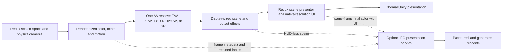

# Architecture and rendering fixes

This describes the v0.6.2 source. Keep it current when a design changes; Git records earlier choices.
[Release notes](releases/v0.6.2.md) describe the shipped beta, and
[standard tests](../tests/README.md) define release validation.

## Modes and ownership

Better AA owns scene anti-aliasing while loaded. It disables MSAA and redirects
the stock AA and render-scale controls to the mod settings so two systems cannot
apply conflicting filters. Off actively disables scene AA; it is also the safe
fallback when a backend cannot run. It does not restore the stock AA selection
until Better AA releases ownership.

| Mode | Implementation |
| --- | --- |
| FXAA Low / High | Redux's PPv2 FXAA in fast / quality mode. |
| SMAA | Redux's PPv2 SMAA at High quality. |
| TAA | The mod's temporal resolve, described below. |
| NVIDIA DLAA | Unity's NVIDIA bridge at equal input/output resolution; RTX support and matching runtimes required. |
| FSR Native AA | The official AMD SDK selects FSR 4.x or FSR 3.1 through the owned native bridge. |
| NVIDIA DLSS / FSR Upscaling | Separate render and display extents through Redux's existing presenter; the UI stays native. |
| Supersampling | Redux's render-scale presenter at 125–200% per dimension, bounded by texture limits. |

Native AA and spatial modes use 100% scene resolution. Supersampling preserves native UI
and falls back to Off in map and menu scenes. AA/reconstruction uses Redux's scene
presenter and pointer-coordinate handling. Optional FG adds the child display path
described below while keeping the original chain progressing. If another
owner changes render scale, the player must explicitly reselect a mode to reclaim it.

The old PPv2 TAA backend is removed. Its saved name and numeric ID 4 migrate to
custom TAA; the other numeric IDs remain stable. Redux's PPv2 library is still
needed for spatial AA, exposure and reversible post-process state. No separate
PPv2 source package or type-scan patch is needed.

Normal settings and F10 use the same mode policy and persistence callbacks,
including the conversion between saved labels and backend IDs. New installs
default to custom TAA; saved Off selections and invalid/unavailable-mode fallbacks
remain Off. Legacy temporal labels and numeric ID 4 migrate to custom TAA.
Sharpness is shared by temporal modes; TAA stability controls stationary history.
When DLAA is selected, entering the main menu resets its preset to K for that
visit. Menu preset edits preserve the saved gameplay preset; other controls keep
their normal persistence. Map AA and foliage repair have separate switches.

Sources: [mod entry point](../Assets/ReduxBetterAA/Code/ReduxBetterAAMod.cs),
[settings policy](../Assets/ReduxBetterAA/Code/Configuration/UserSettingsPolicy.cs),
[graphics patches](../Assets/ReduxBetterAA/Code/Patches/GraphicsSettingsPatches.cs),
[render-scale ownership](../Assets/ReduxBetterAA/Code/Rendering/RenderScaleOwnership.cs).

## Frame flow and lifetime

1. `TemporalCoordinator` discovers the scene cameras, acquires their state and
   activates one backend. Recognized scenes include flight, KSC, VAB, map and menu.
2. Temporal backends use one shared jitter sample per rendered frame. Color,
   depth, motion vectors, projection and history-reset state must describe that
   same frame. The early terrain draw uses the upcoming sample without advancing it.
3. Custom/vendor AA resolves scene color before UI composition through
   `TemporalRenderHook`. Map sprites are replayed after AA with unjittered matrices.
4. Projection state is restored after rendering. Backend resources and scene
   claims are released on mode changes, teardown and shutdown.

Flight/KSC use the physics resolve camera and scaled-space predecessor. Main
menu support verifies `Camera.Scaled` and a preceding `Skybox` sharing its target
and viewport. Map uses the known `MapCamera`. Camera names alone do not establish
a safe render order or justify adding jitter to an unknown graph.

`SceneCameraState` owns depth/motion flags and PPv2 settings for a backend's
lifetime; `CameraProjectionState` owns projection and transparent-jitter fields
for a render. Restore a value only if it still equals what Better AA applied.
Cleanup must be idempotent, including partial activation failure.

History resets on camera/scene changes, significant projection or output changes,
quickload/revert, vessel changes and floating-origin snaps. Ordinary incremental
zoom and fast pans retain history. Origin rebasing resets accumulation while
keeping the camera graph and vendor contexts. Lost GPU storage invalidates
history even if texture dimensions have not changed.

Backends own their history/output textures and native contexts. Recreate them
when storage is lost or immutable context settings change. Cache resources,
reflection and lookups; do not allocate managed memory in steady-state AA
callbacks. Discovery and failed acquisition use bounded retries, not scene scans
on every draw. Failures retain a diagnostic reason and fall back to Off.

Sources: [coordinator](../Assets/ReduxBetterAA/Code/Rendering/TemporalCoordinator.cs),
[camera discovery](../Assets/ReduxBetterAA/Code/Rendering/TemporalCameraDiscovery.cs),
[state ownership](../Assets/ReduxBetterAA/Code/Rendering/SceneCameraState.cs),
[reset policy](../Assets/ReduxBetterAA/Code/Rendering/HistoryResetTracker.cs).

## Game rendering fixes

**Terrain depth and jitter.** `PQSRenderer.DrawPqsDepthNow` draws terrain depth
before ordinary camera rendering. Its projection previously differed from the
jittered color pass, producing coherent terrain flicker under temporal AA.
`TerrainDepthJitterPatch` temporarily applies the upcoming raster projection to
that draw and restores it in a Harmony finalizer, including exceptions. It
changes only `camera.projectionMatrix`: no extra draw, terrain shader replacement,
physics change or reduction in temporal sample coverage.

**Procedural terrain motion.** PQS regenerates world-space vertices from the
planet transform without submitting that transform's previous-frame motion.
During ascent, camera-only vectors therefore miss visible land and coastline
movement. `TerrainMotionCompatibility` observes successful generation, depth and
color submissions on the audited Redux/Unity renderer. It requires a unique
camera/material pair in adjacent frames, the actual bound PQS depth texture,
stable generation transforms and matching sanitizer camera history. Skipped or
failed draws, duplicate submissions, frame gaps, scene changes and origin resets
decline the correction.

The motion shader reconstructs current world position and projects
`previousPlanetWorld * inverse(currentPlanetWorld)` through the previous camera.
It applies this only to nonclear samples matching the terrain depth whose input
motion agrees with Unity's camera-only field. Foreground vessels and existing
object vectors retain their motion. The repair is independent of optional outlier
rejection and is shared by temporal AA, upscaling and their FG consumers; FG does
not apply it twice. This does not infer a separate motion field for transparent
water or clouds, and unsupported renderer versions retain ordinary motion.

**Menu and map planet flicker.** Recognized menu and map cameras apply matching
opaque and transparent jitter. Jittering only opaque rendering left overlapping
planet passes misaligned. Keeping them coherent permits jittered AA in both
scenes. The published v0.6.1 binary predates restored map jitter.

**Flight coastline flicker.** The ocean color material renders in the transparent
queue, while ocean depth runs at `AfterGBuffer` and terrain depth/color use the
jittered raster projection. Leaving transparent rendering unjittered makes those
layers disagree along shallow water and the shoreline on every jitter sample.
The recognized physics/scaled flight stack now shares opaque and transparent
jitter in flight and KSC. The cameras must be active, ordered, share a target and
viewport, and use the known depth-preserving resolve. The existing projection
owner restores the transparent flag on teardown and mode changes. This adds no
draw, texture or setting and applies equally to TAA, DLAA/DLSS and FSR. It repairs
the AA input consumed by independent FG; it does not add ocean motion vectors or
eliminate all animated water, cloud or disocclusion artifacts.

**Map icons.** Map ship icons are scene `SpriteRenderer`s, so ordinary temporal
AA would accumulate them as geometry. `MapIconOverlay` claims known map sprites
on layer 27 using `KSP2/UI/Sprite (Depth Offset)`, suppresses their normal draw,
and replays their original materials at `AfterImageEffects` with unjittered
matrices and camera depth. Visibility, sorting and distance stacking are retained.
New icons register through the map-icon patch; claims restore after rendering
and teardown. This applies to spatial AA too.

**Foliage motion.** The compatible direct vegetation branch is rerouted through
`Graphics.RenderMeshIndirect` with camera-only motion; command-buffer draws stay
with Redux. The repair shader discards the specific invalid object-motion pass
with an identity previous transform and camera-centred current translation,
leaving valid fullscreen camera motion underneath. Unity-version/signature and
shader-ownership checks bound this repair. It defaults on for active AA except
supersampling, and turns off with AA Off. This is separate from the terrain fix.

Sources: [terrain patch](../Assets/ReduxBetterAA/Code/Patches/TerrainDepthJitterPatch.cs),
[terrain motion observation](../Assets/ReduxBetterAA/Code/Rendering/TerrainMotionCompatibility.cs),
[terrain motion boundary](../Assets/ReduxBetterAA/Code/Patches/TerrainMotionCompatibilityPatch.cs),
[projection scope](../Assets/ReduxBetterAA/Code/Rendering/AuxiliaryProjectionScope.cs),
[map overlay](../Assets/ReduxBetterAA/Code/Rendering/MapIconOverlay.cs),
[foliage compatibility](../Assets/ReduxBetterAA/Code/Rendering/VegetationMotionCompatibility.cs),
[foliage shader](../Assets/ReduxBetterAA/Shaders/VegetationMotionVectorRepair.shader).

## Temporal reconstruction and vendor inputs

Custom TAA keeps separate ping-pong color/depth histories. It aligns current
sampling with jitter, selects motion from the nearest surface, reconstructs
current color and cubic history, clips history against a YCoCg neighborhood,
and weights it by motion, depth agreement and reactive change. Camera reprojection
provides a fallback for unusable vectors. Reset frames avoid uninitialized history;
sharpening affects output, never accumulated color. Depth-edge handling protects
thin moving geometry without giving every pixel the history of a nearby surface.

NVIDIA and AMD retain separate API adapters because their context and dispatch
contracts differ. The optional Unity NVIDIA module is late-bound through cached
delegates; modern AMD uses the owned C ABI. Neither reflects vendor methods on every frame.
Both require matching color/depth/motion dimensions, device
depth direction and explicit motion signs. Dispatch jitter is the negative of
raster jitter; normalized motion is scaled to pixels once.
Vendor output stays linear and random-write capable. The pre-dispatch blit
initializes the output and establishes its GPU resource transition; retain it.

`MotionVectorSanitizer` provides component-sign conversion and the eligible
procedural terrain motion correction described above.
Its optional outlier rejection is **off by default**. When enabled, it can reject
invalid motion and substitute depth-derived camera reprojection.
`DepthDisocclusionMask` biases vendor history at moving solid edges
and depth breaks while leaving broad no-depth regions unmarked for transparent
and volumetric accumulation. A missing mask shader is nonfatal.

`Ppv2ExposureReader` caches access to Redux's existing 1×1 auto-exposure result
and reads it asynchronously, no more often than every 0.1 seconds. Vendor
auto-exposure or manual pre-exposure remain fallbacks. Output-only sharpening
changes keep history; temporal-input changes reset it, and immutable vendor
settings recreate the native context.

Sources: [TAA shader](../Assets/ReduxBetterAA/Shaders/CustomTaa.shader),
[backends](../Assets/ReduxBetterAA/Code/Backends),
[motion conversion](../Assets/ReduxBetterAA/Code/Rendering/MotionVectorSanitizer.cs),
[edge mask](../Assets/ReduxBetterAA/Shaders/DepthDisocclusionMask.shader),
[exposure reader](../Assets/ReduxBetterAA/Code/Rendering/Ppv2ExposureReader.cs).

## Diagnostics and distribution

F10 controls, buffer views, motion statistics, performance profiles and Issue
ZIPs are supported features. Reports identify capture stage/frame, selected and
active backend, settings, runtime versions and file hashes. Capture failures
leave normal rendering alive and mark partial results. Nothing uploads automatically.
Motion telemetry uses the report's capture camera, independent of the selected
debug view. Closing a debug view restores its camera depth flags only while
they still match the value the view applied.
Issue ZIP metadata is finalized in the captured camera's output callback after
the AA resolve, before diagnostic copies. Its request-time snapshot remains only
as an explicitly unpaired fallback when rendering is unavailable. The manifest
records metadata and motion-matrix frame matching separately; a stale matrix
keeps its original frame. Actual input texture dimensions and the CPU shader-global
texel-size vectors are separate observations, since another camera can leave
those global vectors stale even when the bound capture texture is current.
Live A/B suspends normal AA ownership and renders two independent arms; use
ordinary mode selection to judge terrain stability or performance.

Profiling starts Unity's CPU/GPU frame counters only for the requested window,
so release players without the Frame Timing Stats build option can still expose
GPU timings. After 30 warmup frames, it measures 240 frames and releases both
recorders on completion, cancellation or invalidation. Native frame timestamps
reject duplicate, stale and warmup records; a recorder fallback is selected at
the warmup boundary when native GPU timings have not arrived. Reports identify
the source, valid sample count and missing-counter reason. GPU time covers the
whole rendered frame, CPU frame time includes waits, and resolve CPU time measures
submission rather than GPU execution. See [Unity's runtime recorder support](https://docs.unity3d.com/6000.5/Documentation/Manual/frame-timing-manager-enable.html).

Builds use Unity's player-script compiler and pinned Addressables. Bundle
identities include the mod's group/project/entry identity to avoid collisions
with other mods. The mod ZIP contains only its assembly, manifest, shader bundle,
catalog and installation/license files. Separate runtime ZIPs contain three
unmodified vendor DLLs plus notices, verified against pinned source hashes.
Build and release instructions live in [CONTRIBUTING.md](../CONTRIBUTING.md).
The candidate test pipeline clones the mod and external harness into a disposable
workspace, installs Redux into a clean game copy, and builds complete local release
packages. It installs those ZIPs and tests core and vendor modes with an isolated
profile and optional online services disabled. Launcher/profile state is restored
and exact inputs are recorded. Local
release preparation needs no GitHub access; publishing is an explicit separate step.

Better AA does not interpolate simulation state, change physics, edit installed
game assemblies, control cloud rendering or reconstruct rays. The optional FG
companion described below generates presentation frames from rendered inputs.
Temporal quality and performance claims require moving in-game evidence on the
stated setup; screenshots and unit tests alone do not establish either.

## Upscaling and frame generation integration

**Implementation branch.** The reconstruction providers share a
version-gated Redux scene-output adapter. NVIDIA uses the existing Unity module;
modern AMD FSR uses an optional native bridge to the pinned FSR SDK 2.3.0. The
SDK selects FSR 4.1.1 on compatible hardware or FSR 3.1.5 where supported. An
actual same-adapter context probe supplies the settings label, never the GPU
name. FSR 3.1 is the sole AMD compatibility provider; the separate Unity FSR2
execution path and runtime dependency are removed. Missing or unsupported modern
runtimes hide AMD choices. Older saved FSR labels migrate to the actual supported
provider, or Off when AMD reconstruction is unavailable. Runtime execution
failure also uses Off and records the reason. Portable TAA remains available.

AMD lists the same RX 590 hardware floor for FSR2 and FSR3 upscaling; frame
generation has a higher floor. This justifies using the SDK's FSR 3.1 fallback
without maintaining another integration. The bridge additionally requires working
same-adapter D3D11/D3D12 texture sharing and fences, which the live probe checks.
[AMD hardware table](https://www.amd.com/en/products/graphics/technologies/fidelityfx/super-resolution.html),
[current SDK recommendation](https://gpuopen.com/fidelityfx-super-resolution-3/).
FG is implemented as a separate optional presentation service, defaulting to
Off, with a common resolved-frame publisher and NVIDIA/AMD child providers.
Completed native discovery supplies its independent setting choices; successful
DLAA/SR initialization proves none of the FG path. Combined-player validation
remains separate from implemented interfaces and standalone SDK behavior.

The source baseline is `9c6cc80dd2bfd638ce1f664a8b03276d56cf4ae9` (v0.6.2
candidate). The inspected installed assemblies are Redux
`0.2.9.0.104521-beta` / `d299b906`, with Unity `6000.5.8f1` / `5cb7df797b7d`.
The development host is an RTX 5070 Ti using D3D11; its real SDK probe selects
FSR 3.1.5. This host cannot validate the FSR 4.1 hardware path. Redux 0.2.8.5 must be inspected and tested separately.
Decompiled game code and downloaded research materials belong outside this
repository and must not be packaged.

### What prevents simply enabling lower render scales

These are source/assembly findings, not performance measurements:

| Existing point | Finding | Required change |
| --- | --- | --- |
| `RenderScaleOwnership.ClampPercent` and `TemporalCoordinator.RefreshBackend` | Better AA permits 100–200%; all modes except supersampling request 100%. | Add explicit reconstruction resolution policy without changing saved native-AA semantics. |
| Installed `KSP.Rendering.RenderScalePresenter.SetRenderScalePercent` / `ShouldUseRenderScale` | Redux accepts 50–200%, but allocates scaled targets only when scale is **greater than 100%**. | A supported sub-native target path; changing the Better AA clamp alone does nothing. |
| Presenter `RebuildPresentBuffer` | The final command buffer always blits its private scene target at `AfterEverything`. | Present the reconstructed display-sized scene through the same presenter. |
| `NvidiaDlaaApi.TryCreateContext` | DLAA quality is fixed, with equal input/output extents. | Parameterize quality, input and output extents; retain native DLAA as its own configuration. |
| Legacy Unity AMD adapter in the source baseline | Equal input/output extents and display-resolution motion. | Replaced by the modern SDK bridge with separate extents and render-sized motion. |
| Both vendor backends / `TemporalTextures` | Output descriptors/cache keys use source size; final blit writes the ordinary image-effect destination. | Keep a display-sized output alive until presentation, with no downsample back into the low-resolution target. |
| `SharedJitterSequence` and vendor configs | Jitter repeats within 4–32 samples and defaults to the native-AA configuration. | Use a reconstruction-specific sequence policy and scale in actual render pixels. |
| `TemporalRenderHook` and installed PPv2 | PPv2 runs its legacy command buffer at `BeforeImageEffects`; builtins include exposure, bloom, grain and color grading/tone mapping. | Explicitly identify the color domain and effect ordering at the new resolve point. |

A linear floating-point texture does **not** establish that its contents are
scene-linear HDR. `SceneCameraState` disables PPv2 AA, but does not disable color
grading or split PPv2 around reconstruction. Keep the first transport experiment
at the existing hook; a production SR route should preferably expose a deliberate
pre-tone-map reconstruction stage and run appropriate output effects afterward.
A post-PPv2 route still needs an explicit color and exposure contract. DLSS SR uses
`IsHDR` processing with pre-exposure 1 and vendor auto-exposure disabled: same-frame
Redux inputs exceeded 1.10, while NVIDIA requires LDR inputs to be bounded to
[0,1] and perceptually encoded rather than linear. High-precision processing does
not imply that this hook precedes tone mapping, and scene exposure is not applied
again. NVIDIA recommends reconstruction before tone mapping; that pipeline change
remains separate work. The SR flag correction requires player validation against
the saved captures. [NVIDIA DLSS Programming Guide, sections 3.1 and 3.1.2, pages 9–10](https://github.com/NVIDIA/DLSS/blob/374959484e79a640feaba44c93ac8cfb0a03f5b5/doc/DLSS_Programming_Guide_Release.pdf).
Modern FSR likewise declares its converted linear input as high dynamic range,
for both the startup probe and native-AA/SR contexts. Both sizes honor the
existing `Fsr2Config` exposure settings: prefer the asynchronous PPv2 scalar,
clamped to 0.2–2, with FSR automatic exposure while it is unavailable; disabling
automatic exposure uses the configured manual pre-exposure. The scalar is passed
through the native dispatch ABI rather than multiplying scene color. With vendor
automatic exposure disabled, the separate algorithm exposure texture is 1; with
it enabled, the texture is omitted and the context enables the SDK auto-exposure
flag. Changing that flag recreates the context and resets history. Deactivation
invalidates the PPv2 reader so a previous camera's sample cannot be reused.

This restores the old native-AA normalization policy that the bridge migration
had replaced with hard-coded ones, including ignoring manual exposure settings.
It is a compatibility policy, not proof that PPv2's post-tone-map output has a
physically removable scene pre-exposure. Moving reconstruction before tone mapping
still requires the separate pipeline work above. AMD reverses its internal
exposure processing before writing output; exposure settings affect reconstruction
and clipping, not a second application brightness pass. Nonlinear-color flags
remain disabled. Both AMD provider guides specify linear input and the HDR
flag for high-range content. [FSR 3.1.5 exposure](https://github.com/GPUOpen-LibrariesAndSDKs/FidelityFX-SDK/blob/60f4ea81909200d8542eca14dccb2628b763a9a3/Kits/FidelityFX/docs/techniques/super-resolution-upscaler.md#exposure),
[FSR 3.1.5 HDR support](https://github.com/GPUOpen-LibrariesAndSDKs/FidelityFX-SDK/blob/60f4ea81909200d8542eca14dccb2628b763a9a3/Kits/FidelityFX/docs/techniques/super-resolution-upscaler.md#hdr-support),
[FSR 4.1.1 HDR support](https://github.com/GPUOpen-LibrariesAndSDKs/FidelityFX-SDK/blob/60f4ea81909200d8542eca14dccb2628b763a9a3/Kits/FidelityFX/docs/techniques/super-resolution-ml.md#hdr-support).
Replacing Redux's PPv2 assembly would violate this project's integration contract.
Its ordinary `BeforeStack` custom-effect slot is not by itself a size-transition
API: the installed stack allocates camera-sized intermediates and rewrites the
effect's source afterward. A pre-PP route must propagate output dimensions,
destination ownership and a depth/motion sampling policy through the remaining
stack explicitly.

The flight graph also has a conditional close-vessel camera. It copies the main
physics camera, clears depth, draws layer 17 with no requested depth/motion
textures, and uses `main.depth + 0.01`, tied with the presenter. That geometry can
fall after the current resolve. Close-vessel/first-person rendering therefore
needs an explicit late-geometry/input policy before claiming SR or FG support.
Redux's `PanelBlurSystem` also follows `GetActivePresentationCameraFor` and
captures at `AfterEverything`; preserve both the mapping and presentation/blur
command-buffer ordering. Its capture must follow the reconstructed scene blit,
including after resize or command-buffer rebuild.

### Approaches considered

Rankings describe fit with this mod, not demonstrated visual quality or speed.

| Approach | Fit and decision |
| --- | --- |
| Extend the existing Unity NVIDIA/AMD bridges for SR | **Preferred first implementation.** Reuses optional runtime loading, vendor dispatch, history ownership, terrain repair and diagnostics. The renderer/presenter handoff is the main work. |
| Add a small supported Redux reconstruction/presentation API | **Preferred integration boundary.** Redux continues to own targets, camera ordering, raycasters and screen-coordinate mapping. Better AA supplies a reconstructed scene. Requires a Redux change; this API does not currently exist. |
| Version-specific Harmony presenter adapter | **Bounded prototype/fallback.** May enable sub-native allocation and substitute the presentation source at runtime. Confine private members/signatures to one adapter, check compatibility before acquisition and restore conditionally. Never patch installed DLL files. |
| Direct native NGX/DLSS SR or AMD SDK integration | **Selected for modern AMD FSR.** Unity's managed AMD module exposes FSR 2 only. The owned C ABI bridges D3D11 inputs through same-adapter shared DX12 resources and fences to the official SDK; NVIDIA continues using Unity's existing module. |
| MIT `ndepoel/FSR3Unity` compute/C# core | **Useful alternative SR provider.** Can remove the AMD native bridge dependency and supports built-in/DX11. It is FSR 3.1 upscaling, not FG. Adapt its algorithm core to our camera contract; do not import its camera/PPv2 ownership wholesale. [Project source](https://github.com/ndepoel/FSR3Unity). |
| Commercial Unity SR packages | Available, but offer less benefit than reusing the adapters already here. Their camera integration is not automatically compatible with Redux's multiple scene cameras. [Provider](https://thenakeddev.com/). |
| Commercial Unity DLSS/FSR FG bridge | **Alternative requiring licensed source/API review.** Its documented DX12 FG swapchain with DX11 rendering is relevant, but custom-input hooks and redistribution remain unresolved. No licensed package is available in this checkout. [FG manual](https://docs.google.com/document/d/1L8C8H_RGuyip7aI0ckqqiAKeg7RB07yKb8EQNCDSw0Y). |
| Our own native DX11-to-DX12 presentation bridge | **Implemented route.** Keeps Redux's D3D11 renderer and original chain progressing, copies explicit inputs to the selected provider's D3D12 device and uses an owned disabled child HWND for paced output. The coordinator joins real EOF/capture tickets and owns source Present exactly once; player validation remains separate. |
| Native D3D12 renderer plus official Streamline / FidelityFX FG | Architecturally conventional, but prerequisite game/shader compatibility is unproven. Treat renderer migration as separate Redux work, not an AA option or a launch-flag fix. |
| Vulkan renderer / DXVK translation | Experimental compatibility branch only. Requires player, shaders, UI, native-AA and FG integration validation. NVIDIA's current FG guide covers Vulkan; AMD SDK support depends on the pinned revision. |
| OptiScaler / DLSSG-to-FSR3 wrappers | Useful external experiments, poor core dependency. Upscaler interception does not provide missing camera/presentation contracts. Current OptiFG documentation limits FG to DX12; DX11 SR support is a separate capability. [OptiScaler](https://github.com/optiscaler/OptiScaler), [OptiFG](https://github.com/optiscaler/OptiScaler/wiki/OptiFG). |
| Driver FG / capture-based interpolation | Useful comparison baselines, not implementations of this mod's DLSS/FSR FG integration. They do not consume Better AA's explicit scene/depth/motion/UI contract. [NVIDIA Smooth Motion](https://www.nvidia.com/en-ph/geforce/news/nvidia-app-global-dlss-overrides-rtx-40-series-smooth-motion/), [AMD AFMF](https://www.amd.com/en/products/software/adrenalin/afmf.html). |
| Camera viewport tricks, duplicate presentation stacks, CPU image interpolation | Poor default fit: risk competing camera dimensions, input mapping, render order or avoidable transfers. Reuse Redux's existing ownership before inventing another scene camera stack. |

The coordinator pins the official Unity **6000.5.8f1** `Editor/Data/PluginAPI`
headers to match the gated Redux player. In that API,
`IUnityGraphicsD3D11.h` exposes `GetSwapChain`, `GetSyncInterval` and
`GetPresentFlags`; `IUnityGraphicsD3D12.h` exposes v8, queue/fence access and
swapchain access. `IUnityRenderingExtensions.h` provides
`kUnityRenderingExtQueryOverridePresentFrame`, which tells Unity to skip its
own Present, and documents the `GfxPlugin` preload naming convention. Merely
copying a new DLL into a built player does not ensure automatic preload.
`FrameGenerationNative` invokes `RbaFgGetRenderEventFunc` through Unity's DllImport
loader so Unity supplies `UnityPluginLoad`, then checks the actual module path
and initialized renderer. Late initialization registers the device callback and
inspects the existing renderer; it does not manually invoke `UnityPluginLoad`.
There is no swapchain replacement setter in these interfaces.

The commercial FG manual supports Windows x64 DX11/DX12 and built-in/URP/HDRP,
but excludes DX11 exclusive fullscreen and Editor testing. It describes global
camera coverage, pause/resume, and window/resolution changes during full
enable/disable. Its public API does not establish how to supply our depth,
sanitized motion, HUD-less color or separate UI. Before adopting it, inspect
the licensed package for custom-input hooks, preload requirements, native source
availability, Reflex integration and compiled-mod distribution rights. The
store lists an Extension Asset under the Unity Asset Store EULA; it is not
source that can simply be vendored into this MIT repository. No purchase or
author contact is part of this investigation.
[DLSS FG listing](https://assetstore.unity.com/packages/tools/utilities/dlss-4-5-frame-generation-for-unity-385490),
[FSR FG listing](https://assetstore.unity.com/packages/tools/utilities/fsr-4-frame-generation-for-unity-296367),
[Asset Store terms](https://unity.com/legal/as-terms).

### Shared reconstruction contract

`ReduxSceneOutput` is Better AA's private compatibility adapter, not a public
Redux API. It is gated to Assembly-CSharp MVID
`7d0cb6df-eda7-43ac-8386-a1c00da65d32`, Unity 6000.5.8f1 and D3D11. The
existing coordinator, backend registry and vendor adapters retain their roles.
`SceneOutputFrame` supplies ownership, graph generation, current real frame and
both extents; an expired submission cannot be presented.

One coordinator decides ownership of every real-frame Present. With FG active,
it maintains exactly one original Unity swapchain Present per real frame and
presents real/generated images on its owned child chain. Original-chain calls,
child calls and SDK-reported generated presentations are separate counters.
The FG service never advances simulation, camera jitter or temporal history for
generated frames. Keeping the original chain progressing is necessary for this
Unity player's frame-latency wait; hiding its surface does not remove that wait.

The D3D12 chain has a separate HWND ownership contract. DXGI permits only
one flip-model swapchain per HWND; Unity's Present override does not relinquish
its existing chain or provide a replacement setter. Do not create a second
flip-model chain against that HWND and assume it is supported.
[DXGI window/swapchain contract](https://learn.microsoft.com/en-us/windows/win32/api/dxgi1_2/nf-dxgi1_2-idxgifactory2-createswapchainforhwnd).

Windows also supports a D3D12 **composition** swapchain attached through
DirectComposition to the existing Unity window, distinct from a second
HWND-bound flip chain. That API capability is not the selected vendor FG path:
the pinned AMD wrapper requires an HWND, and Streamline composition interception
has not established a usable path. Diagnostic composition code stays separate
from the child-window coordinator.
[Composition chain](https://learn.microsoft.com/en-us/windows/win32/api/dxgi1_2/nf-dxgi1_2-idxgifactory2-createswapchainforcomposition),
[existing-window composition](https://learn.microsoft.com/en-us/windows/win32/api/dcomp/nf-dcomp-idcompositiondevice-createtargetforhwnd).

The selected route is a full-client **disabled child HWND**, owned by the Unity
window thread, with one intercepted D3D12 child swapchain. The original window
retains focus, keyboard/mouse input and its existing unhooked chain. The child
starts hidden and becomes visible only with a fresh completed image; resize,
missing inputs or disable hide it immediately. Its epoch/lease remains alive
until every provider and GPU user retires. Never substitute an invented HWND,
change the parent's styles or forward synthetic input to compensate for ownership.

This supplies the real HWND required by both Streamline's supported interception
path and the pinned AMD swapchain wrapper. The AMD wrapper cannot directly wrap
the composition chain; the child route uses its existing pacing code without
implementing a replacement scheduler. Existing non-FG
chains are allowed with selective hooking. Unity's original chain does not by
itself rule out a separate child FG chain.
[Pinned source findings](../Native/Presentation/README.md).

The shared frame description needs:

- A real-render frame ID, camera-graph generation and reset reason.
- Actual render dimensions, maximum render allocation, output dimensions and
  viewport; never infer all four from `Screen.width` or a rounded percentage.
  Unity's screen/reconstruction dimensions can differ from the native borderless
  swapchain dimensions. The FG owner uses the actual swapchain extent and
  reproduces any final scene scaling before
  comparing HUD-less and final-with-UI inputs.
- Color domain/transfer function, actual exposure convention, depth direction
  and near/far planes, normalized-or-pixel motion convention, jitter in render
  pixels, and non-jittered current/previous transforms.
- Color, depth, motion and optional reactive/transparency textures, with clear
  ownership and the completion point after which they can be released/reused.

Redux should expose one revocable scene-output claim: request render dimensions,
read the validated camera/target graph, submit the reconstructed output for the
same real frame, and release the claim. Submission must be rejected after a
resize/scene generation change. Missing output uses that frame's scene source
and schedules native-resolution fallback; it must not present an old frame.
Keep Redux's raycasters and coordinate conversion against the render target.
Preserve conditional restoration and refuse a second owner. Begin with the
ordinary scaled-space/physics graph in flight/KSC, excluding close-vessel
rendering until validated. Map/menu/VAB need their own graph proofs before SR
is exposed there. Native-resolution AA can remain supported in those scenes.

For DLSS, generalize `NvidiaDlaaApi` with separate input/output sizes and actual
quality selection; query Unity's optimal-size API when available. Keep DLAA
settings/preset migration separate from SR quality presets. For modern FSR, populate
`maxRenderSize` and `displaySize` separately, dispatch the actual input size,
and clear the display-resolution-motion flag when motion is render-sized.
Preserve the single normalized-to-pixel conversion and opposite-sign dispatch
jitter. Output texture cache keys must include both extents, format and immutable
vendor settings. Retain the pre-dispatch output initialization/transition blit.

Start with fixed quality levels, not automatic dynamic resolution. At 2560×1440,
a 50% transport test must show **1280×720 color/depth/motion → 2560×1440 scene
output → 2560×1440 UI**. Quality/balanced sizes should follow each SDK's sizing
rules and the actual allocated dimensions; Redux's integer percentage is not an
exact quality-mode definition. Its current 50% floor excludes 33% Ultra Performance.
Do not relax that floor until its quality and resource behavior are tested.

FSR's jitter phase count increases with output/render ratio; its native-AA
8-sample default and current 32-sample cap cannot be copied unchanged to every
ratio. Mip bias also needs a scoped policy for terrain/scene textures, excluding
UI and respecting other mods. A depth-edge mask is not a complete transparency
reactive mask: plumes, clouds, water, foliage and disocclusion need moving
validation. Follow the pinned algorithm's input requirements rather than
changing vendor defaults to conceal bad inputs.
[FSR 3.1 integration](https://github.com/GPUOpen-LibrariesAndSDKs/FidelityFX-SDK/blob/60f4ea81909200d8542eca14dccb2628b763a9a3/Kits/FidelityFX/docs/techniques/super-resolution-upscaler.md),
[Unity DLSS API](https://docs.unity3d.com/ScriptReference/NVIDIA.GraphicsDevice.html).

### Independent frame-generation contract

`FrameGenerationRuntime` is the optional presentation service; it is independent
of `ITemporalBackend` and Redux's reconstruction scale claim. One shared
**Frame generation** setting combines provider and total display multiplier:
**Off**, **Auto**, **DLSS 2x**, **DLSS 3x**, **DLSS 4x**, **FSR 4 2x** and
**FSR 3.1 2x**. Off is the default. The regular menu and F10 use the same policy
and persisted value; there are no separate enable/provider/multiplier controls.
FG-only changes have a separate deferred apply path and do not reconfigure AA
or acquire render-scale ownership.

`FrameGenerationNative` binds the installed coordinator through Unity's native
plugin loader, then verifies the loaded module's exact path, initialized renderer
and ABI. `FrameGenerationRuntime` discovers each installed provider with a hidden
child context. `FrameGenerationAvailability` publishes its actual SDK multiplier
mask and, for AMD, selected family/version only after the probe context and child
lease retire. File presence, a GPU name and successful DLAA/SR initialization are
not capability checks. A completed probe makes a development choice available;
it does not certify combined player image quality, cadence or latency.

The saved request is distinct from the effective fallback and temporary scene
suspension. Invalid strings become Off; a saved unavailable request stays visible
with its reason while the actual available-provider list remains truthful.
Diagnostics distinguish request, selected provider and active presentation;
displayed FPS and latency remain unset until measured rather than inferred from
the multiplier.

| Requested value | Compatibility order |
| --- | --- |
| Auto | Highest supported DLSS multiplier up to 4x, then FSR 4 2x, then FSR 3.1 2x, then Off. |
| DLSS 4x / 3x / 2x | Highest supported DLSS multiplier no greater than requested, then supported FSR 2x, then Off. |
| FSR 4 2x | FSR 4 2x, then FSR 3.1 2x, then Off. |
| FSR 3.1 2x | FSR 3.1 2x, then Off; preserve an explicit compatibility-provider choice. |

NVIDIA's `numFramesToGenerateMax` counts generated frames; the menu counts total
frames, so 2x means one generated frame. The provider intersects the actual SDK
mask with the supported 2x–4x scope. This permits ordinary 2x FG on a device that
cannot run the requested MFG multiplier, without identifying support from an
RTX model name. AMD best and explicit compatibility probes use the pinned
SDK's separate FG version selection: FG 4.0.1 where supported, or FG 3.1.6.
Its swapchain implementation is 3.1.7. An FSR 4.1 SR context does not prove FG 4
support; AMD's output-array capacity does not prove MFG, so AMD exposes 2x only.

The common publisher permits TAA, DLAA, FSR Native AA or SR to feed either
available FG provider. Selecting NVIDIA FG does not force DLSS SR or a reduced
render scale; FSR FG can remain available when NVIDIA FG is unavailable. These
pairings share capture and presentation code, rather than creating an FG backend
for each AA mode. Capture/provider failures suspend FG and preserve normal AA.

### Resolved-frame publisher and input ownership

`ResolvedFrameCapture` registers one optional `IResolvedFrameConsumer`. Each
backend owns its producer lifecycle and sequence; the token also carries the
actual Unity frame ID for joining its scene to that frame's final backbuffer.
Native AA has its own producer identity without claiming an SR scale lease.
No consumer, or a consumer declining `TryBegin`, causes no FG texture copy or
allocation in the backend. Off may still observe metadata needed for later
activation; it does not capture pixels.

| Producer seam | Published successful result |
| --- | --- |
| `CustomTaaBackend.RenderCore` | The final sharp/plain resolve pass writes an accepted leased target, then blits that actual result to the normal destination. Debug views and a missing/incompatible target decline capture. History color and linearized history depth are never published as final color/device depth. |
| `NvidiaDlaaBackend.RenderCore` | Actual `_output` after successful execution, with local raw device depth and sanitized motion. |
| `AmdFsr2Backend.RenderCore` | Actual `_output` after successful native execution, with matching local depth/motion and reset metadata. The class name is retained internally; the algorithm is modern FSR. |
| Either SR branch | Publication follows an accepted `ReduxSceneOutput.Submit` for the same real-frame token. The ordinary image-effect destination is a low-resolution placeholder and is never used as the resolved SR image. |

The publisher snapshots nonjittered GPU projection, rigid world-to-view,
current/previous transforms, jitter in render pixels, depth direction, camera
planes/FOV/aspect, reset state, exposure convention and unscaled frame time before
advancing history. Wire matrices are row-indexed storage with Unity column-vector
multiplication. A frame gap resets provider history instead of inventing motion
across missing Unity frames.

The native FG inputs use top-left texture coordinates. `FrameGenerationSurfaces`
sets `_NativeFlipY` when converting HUD-less color, raw depth and sanitized motion;
all three sample `y = 1 - y`. Depth also retains Unity's required source
`_MainTex_TexelSize` correction before that conversion. The final swapchain copy
already has native orientation and is not flipped. Flipping sampling positions
does not change stored motion-vector components.

| Quantity | Conversion at the common FG boundary |
| --- | --- |
| Motion | The sanitizer stores `(current UV - previous UV)` in bottom-left coordinates, multiplied by its configured component signs. Native previous-minus-current, top-left motion therefore uses scale `(-signX, +signY)`. AMD then multiplies by the actual render dimensions exactly once. |
| Projection and transforms | Native AA's GPU projection already has the required clip orientation. `Camera.NativeClip` negates row 1 only for a projection captured with `ProjectionRendersIntoTexture`; apply the same conversion to projection, current view-projection and previous view-projection. World-to-view is unchanged. |
| Raster jitter | PPv2's perspective jitter adds `2*jX/width` and `2*jY/height` to projection offsets. With Unity's view-space forward convention, the resulting native top-left pixel displacement is `(-jX, +jY)`. This displacement is the FG wire jitter; it is separate from the existing SR dispatch convention. |

The shader tests use asymmetric color/depth/motion patterns; camera tests verify
signed motion, projection and nonzero jitter analytically. These protect the shared
coordinate contract but do not establish moving-image quality in the player.

A consumer borrows resolved color, raw device depth and sanitized motion only
within the callback. It queues its own GPU copies before the borrow closes.
Producer generations and borrow serials prevent a reentrant callback from
committing old metadata into a reconfigured producer; failures close the borrow
idempotently and disable capture while the AA output remains usable.

The publisher's motion surface preserves the AA backend's diagnostic choice:
with outlier rejection disabled, that surface still converts component signs
and repairs eligible procedural terrain motion.
`FrameGenerationRuntime` therefore owns an independent, required motion filter.
It uses the borrowed frame's exact current/previous matrices, jitter, reset and
component signs, together with the normalized native depth slot. The filter
returns depth rows to the motion shader's bottom-left coordinates, rejects
nonfinite/excessive vectors and detects a broadly corrupted field before using
bounded camera reprojection. Reset frames discard stale motion. This does not
change the AA sanitizer setting or advance its history. The repaired motion is
copied into the immutable FG slot before its native capture event; intermediate
filter surfaces can be reused in Unity command order. A missing shader or invalid
snapshot declines FG capture while normal AA continues.

`FrameGenerationSurfaces` owns three managed source slots. Each contains physical
display-sized RGBA8 encoded-sRGB HUD-less color, render-sized R32 raw depth and
RG16 normalized motion, plus a TAA final target when needed. The native
`FrameGenerationInputPool` owns three immutable shared slots on the selected
provider's actual same-adapter D3D12 device and DIRECT queue. It accepts already
converted D3D11 inputs; it does not create a second private D3D12 device or copy
provider output back through D3D11.

The render-thread capture event queues scene copies after Unity's conversion
commands. At the matching Present query, `CopyFinal` copies the original D3D11
backbuffer before its source Present. Separate D3D11 copy and D3D12 ready/retirement
fences govern slot reuse. Retaining a managed or COM reference alone is not a
pixel lease. Managed surfaces remain immutable until a native source-copy
acknowledgment; native slots remain immutable through provider retirement and a
queue-signaled retirement fence. Busy does not permit overwrite, and unknown
completion after failure/device loss quarantines resources instead of freeing
them by elapsed time.

### Final UI, color and native presentation

The initial UI strategy supplies retained HUD-less scene color and the same
real frame's final color including UI. It uses the vendors' basic compatibility
handling, including AMD's HUD-less configuration; it does not promise exact
premultiplied alpha extraction. Final UI color must include all rendering before
the actual Present, while the scene capture must match its scaling and encoding.
Toolkit/canvas UI, IMGUI/F10, cursors and moving overlays still require player
validation. Never rerun UI callbacks, physics or simulation for generated frames.

The runtime uses actual native backbuffer dimensions, not `Screen.width`, to size
the HUD-less copy and final UI input. Redux's reconstruction size and the native
window size may differ; the scene is scaled to the native extent while preserving
the validated aspect. The supported output is windowed/borderless RGBA8 SDR with
actual Unity HDR disabled. A monitor's HDR desktop color space describes the
composition target, not necessarily the game's swapchain; it does not by itself
reject an SDR game surface. HDR/scRGB/10-bit game output and exclusive fullscreen
remain outside this path. The parent client and native backbuffer extents must
match the full-client child. If a windowed resize leaves Redux's backbuffer at
another size, FG hides/drains the child and suspends; it can re-arm after matching
geometry returns. Windowed mode alone does not prove compatible dimensions.

`GfxPluginReduxBetterAAFrameGeneration.dll` owns the exact Unity Present query
and a full-client `WS_CHILD | WS_DISABLED` HWND on the parent window thread.
The parent retains focus/input and its existing D3D11 chain; the selected vendor
owns one D3D12 child chain. The child starts hidden and is shown only for a fresh
completed image. Epoch changes, invalid inputs and disable stop acceptance and
hide it; its HWND cannot be destroyed until every provider present permit and
GPU lease has retired. The UI thread never waits for the render worker.

One real EOF packet is queued after all cameras/UI every Unity frame, including
Off, menus and retirement. It advances per-frame Present ownership even without
a scene capture. The coordinator either yields the original Present to Unity or
claims the ticket, copies final color and calls the original chain exactly once
with Unity's sync interval/flags before submitting the child frame. Duplicate
queries and failed owned Present attempts cannot issue a second source Present.
This source-maintenance contract preserves Unity's frame-latency waitable chain;
it does not replace or retroactively hook the parent's chain. Supported tearing
flags must agree with windowed mode, sync interval zero and chain capability.

The initial providers retain one accepted input batch. A valid current captured
frame may wait on the presentation thread for the preceding batch for at most
50ms. NVIDIA uses its bounded Poll; AMD polls its worker with a monotonic deadline.
The wait is excluded from Off, draining, menus and invalid captures. Controls,
window epoch and scene eligibility are rechecked before continuing. A timeout
drops the current capture while retaining the previous input/window leases;
completion permits the next batch and a frame gap resets history. Eligible
same-epoch backpressure retains an already visible completed image instead of
alternating between the child and the ordinary source chain. Only a newer
completed image advances the 250ms progress deadline; repeated polls or dropped
captures cannot extend it. If that deadline expires, the child hides once and FG
remains suspended for that selection epoch. The diagnostic reason directs the
player to select Off, then reselect FG to retry. Invalid captures, scene changes,
resize and disable still hide/drain immediately. Under heavy load, fewer captures
may contribute generated frames while ordinary rendering continues. These bounds
are not latency or frame-rate guarantees.

`StreamlineProvider` initializes pinned Streamline 2.14.1 before creating its
intercepted D3D12 queue/child chain, with selective manual hooking that leaves
Unity's existing chain alone. Real PlayerLoop simulation/render boundaries feed
Reflex markers; constants and four retained textures describe that real frame.
SDK and queue completion govern retirement. Runtime restart preserves the
provider's own verified module ownership rather than adopting an unrelated
preloaded runtime. Healthy Off disables DLSS-G and frees its viewport resources,
child chain and retained inputs after retirement. It keeps one initialized SDK,
device and queue session so NGX callbacks never depend on an unloaded/reinitialized
`sl.common`. Reuse requires the same pinned physical runtime directory and module
identities, adapter, presentation thread and healthy device. A new child chain and
viewport are created for the next activation. Terminal initialization or cleanup
failure poisons the session and requires process restart; it is not retried as a
healthy cache. Idle and quarantined ownership holders are retained through process
exit, avoiding SDK calls or COM teardown from DLL static destruction under the
Windows loader lock. This bounded retention does not keep a healthy Off window or
input lease alive. [FG integration](https://github.com/NVIDIA-RTX/Streamline/blob/v2.14.1/docs/ProgrammingGuideDLSS_G.md),
[manual hooking](https://github.com/NVIDIA-RTX/Streamline/blob/v2.14.1/docs/ProgrammingGuideManualHooking.md),
[Reflex](https://github.com/NVIDIA-RTX/Streamline/blob/v2.14.1/docs/ProgrammingGuideReflex.md).

`AmdFrameGenerationProvider` uses the official versioned Configure/PrepareV2 and
swapchain callback path on a persistent worker. The SDK paces generated and real
child presents; the coordinator does not emit them back-to-back itself. The
worker retains the four textures and HWND present permit through SDK presentation
waits, queue completion and restoration of inputs to COMMON. SDK waits that may
be unbounded stay on that worker; bounded caller polling and asynchronous Destroy
never claim retirement merely because the caller stopped waiting.
[AMD SDK and component terms](https://github.com/GPUOpen-LibrariesAndSDKs/FidelityFX-SDK/tree/60f4ea81909200d8542eca14dccb2628b763a9a3),
[FG 4 requirements/call order](https://github.com/GPUOpen-LibrariesAndSDKs/FidelityFX-SDK/blob/60f4ea81909200d8542eca14dccb2628b763a9a3/Kits/FidelityFX/docs/techniques/frame-interpolation-ml.md).

### Native modules and packaging

| Module | Runtime responsibility |
| --- | --- |
| [Presentation](../Native/Presentation/README.md) | Unity initialization/query ABI, child HWND lifetime, real EOF/capture tickets, source Present ownership, provider switching and asynchronous retirement. |
| [Streamline](../Native/Streamline/README.md) | Pinned runtime loading, real capability discovery, Reflex/constants/tagging, intercepted DLSS-G child chain and 2x–4x dispatch. |
| [AMD FG](../Native/FrameGeneration/README.md) | Shared D3D11-to-provider-D3D12 input pool, actual best/compatibility SDK contexts and paced AMD 2x child provider. Direct texture/round-trip targets remain separate diagnostic tools. |

The optional `tools/Build-Native.ps1 -FrameGeneration` route builds the coordinator
and explicitly selected providers from pinned external inputs. Its companion ZIP
puts the coordinator in `KSP2_x64_Data/Plugins/x86_64` and providers/runtimes
under `mods/ReduxBetterAA/native/frame-generation`; it includes exact component
notices and verifies hashes/ABI exports. It does not download vendor binaries,
replace game assemblies or add native files to the main mod ZIP. NVIDIA and AMD
components are independently optional. See [native packaging](../NATIVES.md#frame-generation-companion).

FG starts disabled and suspends across unsupported scenes/cameras, loading,
quickload/revert, vessel changes, resize and other invalidated frame sequences.
Paused gameplay uses real unscaled timing for camera/UI updates, without generating
simulation steps. Main-thread Tick and EOF pumping continue during shutdown until
native tickets, provider work and the child lease retire. KSP2 CPU/physics limits
remain independent of lower render resolution or extra displayed frames.

### Validation requirements

The standard checks are maintained in [tests/README.md](../tests/README.md).
Build the main mod with the pinned Unity 6000.5.8f1 editor, run focused managed
and native contracts, and review both the main ZIP and optional FG companion.
Dependency changes need a fresh-checkout build. Keep counts, captures, source
hashes and run-specific results in release/PR records outside this architecture.

Limited integration checks on RTX 5070 Ti exercise the packaged D3D11 player
path with DLSS 2x–4x and FSR 3.1 FG 2x. DLSS 4x was exercised with TAA, DLAA,
FSR Native AA and both SR producers; DLSS 2x/3x with TAA; and FSR 3.1 FG 2x with
TAA, FSR Native AA and FSR SR. Coverage also includes actual capability-driven
settings and Auto selection, provider/multiplier switches and Off/re-enable. Captured resolved
color, final UI color, raw depth and protected motion agree with the common
orientation and camera/jitter contract. Source-chain ownership counters show one
original Present per owned real frame; separate SDK/native counters record extra
vendor presentations. Off retires the child and input pool. These checks establish
bounded integration behavior, not broad image quality or displayed cadence.

Window/backbuffer extent mismatch correctly suspends FG, and restoring matching
geometry permits automatic re-creation. This does not establish the provider's
explicit `WindowChanged` error branch, minimize/alt-tab or device-loss recovery.
AMD FG 4 and older RTX hardware have not been physically tested. Limited
PresentMon traces cover native-AA/FG combinations and a heavy scene; broader
displayed cadence, input latency and moving flight/UI quality remain unvalidated.
The live traces did not trigger the 250 ms fallback. Its deadline, latched
ordinary-rendering state and explicit Off/re-enable recovery are covered by
native contracts. Heavy GPU load can drop current captures while preserving
pending leases; no requested multiplier implies a measured FPS gain.

Required player coverage includes each native-AA/SR producer with each available
FG provider, missing-runtime fallback, repeated Off/re-enable and provider changes,
terrain/struts during pan and launch, plumes/clouds/foliage, floating origin,
time warp, quickload/revert, vessel changes, menu/map/VAB transitions, other mods,
minimize/alt-tab, window modes, resolution/UI scaling and device recovery. Inspect
actual same-frame color/depth/motion and final UI inputs, not only native success
counters. Use normal mode selection with F10 live A/B stopped for timing.

Track original-chain Present attempts/successes, child real calls and SDK/native
generated-presentation evidence separately. A per-ticket `GetLastPresentCount`
delta can detect duplicate source ownership; reset evidence on query failure,
chain replacement or discontinuity. It does not establish displayed cadence.
Presentation-aware tracing such as PresentMon/ETW is needed for display and
latency claims; ordinary Unity screenshots, capture-file FPS and Unity FPS times
a multiplier do not provide those measurements.
[Present call counter](https://learn.microsoft.com/en-us/windows/win32/api/dxgi/nf-dxgi-idxgiswapchain-getlastpresentcount).

The reconstruction adapter implements fixed quality reconstruction and restoration;
pre-tone-map output effects, scoped texture mip bias and complete reactive masks
remain follow-up quality work. Close-vessel SR currently fails eligibility with
an explicit reason because its native-color composition/depth/motion contract is
not yet proven. Do not expose a native-close toggle that only switches rendering
order: that would mix raw geometry with post-tone-map color and leave FG blind
to the close geometry.

`FrameGenerationFrame` describes immutable metadata for per-frame resources,
color/motion conventions, exposure/jitter, explicit nonjittered camera transforms,
FOV/aspect, producer completion and retained input lifetimes. Its texture snapshots
detect changed descriptors and liveness, not pixel overwrites or every native
allocation recreation. Only a real native slot/fence lease can guarantee retention.
`FrameGenerationGate` rejects stale graph/frame tokens, incompatible providers,
HUD-contaminated color, incomplete UI separation, reset warmup, and native close
composition without display-sized depth, motion and coverage. These are
declarative eligibility checks, not the native lease authority. The
live basic-UI path instead uses `ResolvedFrameCapture`, native capture/EOF tickets
and actual copy/provider fences. It does not set `FrameGenerationInputsComplete`
or promote these metadata snapshots into proof of complete close-vessel/UI
coverage.

The intended optional close-vessel sequence is world reconstruction, native-sized
close-vessel shading/composition into a common color domain with full depth and
motion coverage, full-scene FG, then separable UI composition. A depth/occlusion
prepass before world SR may be necessary to keep background history from leaking
through close silhouettes. A close vessel cannot be treated as a UI overlay or
painted only on real frames. Until those inputs exist, normal full-scene native
AA is the compatibility path.

## Runtime distribution

Public downloads combine all applicable native components into one archive per
Redux/Unity version. NVIDIA player libraries retain their engine pins; the FSR
component is shared, and the FG Unity plugin/providers are included only for the
pinned Redux 0.2.9.0 / Unity 6000.5.8f1 integration. Component build archives are
maintainer intermediates. The combined packager validates each input, rejects
path collisions and records all payload hashes without changing runtime behavior.
