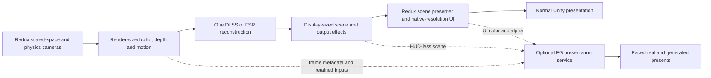

# Architecture and rendering fixes

This describes the current source, including changes since the published v0.6.1
binary. Keep it current when a design changes; Git records earlier choices.
[Release notes](releases/v0.6.1.md) describe the shipped beta, and
[standard tests](../tests/README.md) define release validation.

## Modes and ownership

Better AA owns scene anti-aliasing while loaded. It disables MSAA and redirects
the stock AA and render-scale controls to the mod settings so two systems cannot
apply conflicting filters. Off actively disables scene AA; it is also the safe
fallback when a backend cannot run. It does not restore the stock AA selection
until Better AA releases ownership.

| Mode | Implementation |
| --- | --- |
| FXAA Low / High | Redux's PPv2 FXAA in fast / quality mode. |
| SMAA | Redux's PPv2 SMAA at High quality. |
| TAA | The mod's temporal resolve, described below. |
| NVIDIA DLAA | Unity's NVIDIA bridge at equal input/output resolution; RTX support and matching runtimes required. |
| FSR Native AA | The official AMD SDK selects FSR 4.x or FSR 3.1 through the owned native bridge. |
| NVIDIA DLSS / FSR Upscaling | Separate render and display extents through Redux's existing presenter; the UI stays native. |
| Supersampling | Redux's render-scale presenter at 125–200% per dimension, bounded by texture limits. |

Native AA and spatial modes use 100% scene resolution. Supersampling preserves native UI
and falls back to Off in map and menu scenes. Better AA uses Redux's presenter
instead of replacing presentation or pointer-coordinate handling. If another
owner changes render scale, the player must explicitly reselect a mode to reclaim it.

The old PPv2 TAA backend is removed. Its saved name and numeric ID 4 migrate to
custom TAA; the other numeric IDs remain stable. Redux's PPv2 library is still
needed for spatial AA, exposure and reversible post-process state. No separate
PPv2 source package or type-scan patch is needed.

Normal settings and F10 use the same mode policy and persistence callbacks,
including the conversion between saved labels and backend IDs. New installs
default to custom TAA; saved Off selections and invalid/unavailable-mode fallbacks
remain Off. Legacy temporal labels and numeric ID 4 migrate to custom TAA.
Sharpness is shared by temporal modes; TAA stability controls stationary history.
When DLAA is selected, entering the main menu resets its preset to K for that
visit. Menu preset edits preserve the saved gameplay preset; other controls keep
their normal persistence. Map AA and foliage repair have separate switches.

Sources: [mod entry point](../Assets/ReduxBetterAA/Code/ReduxBetterAAMod.cs),
[settings policy](../Assets/ReduxBetterAA/Code/Configuration/UserSettingsPolicy.cs),
[graphics patches](../Assets/ReduxBetterAA/Code/Patches/GraphicsSettingsPatches.cs),
[render-scale ownership](../Assets/ReduxBetterAA/Code/Rendering/RenderScaleOwnership.cs).

## Frame flow and lifetime

1. `TemporalCoordinator` discovers the scene cameras, acquires their state and
   activates one backend. Recognized scenes include flight, KSC, VAB, map and menu.
2. Temporal backends use one shared jitter sample per rendered frame. Color,
   depth, motion vectors, projection and history-reset state must describe that
   same frame. The early terrain draw uses the upcoming sample without advancing it.
3. Custom/vendor AA resolves scene color before UI composition through
   `TemporalRenderHook`. Map sprites are replayed after AA with unjittered matrices.
4. Projection state is restored after rendering. Backend resources and scene
   claims are released on mode changes, teardown and shutdown.

Flight/KSC use the physics resolve camera and scaled-space predecessor. Main
menu support verifies `Camera.Scaled` and a preceding `Skybox` sharing its target
and viewport. Map uses the known `MapCamera`. Camera names alone do not establish
a safe render order or justify adding jitter to an unknown graph.

`SceneCameraState` owns depth/motion flags and PPv2 settings for a backend's
lifetime; `CameraProjectionState` owns projection and transparent-jitter fields
for a render. Restore a value only if it still equals what Better AA applied.
Cleanup must be idempotent, including partial activation failure.

History resets on camera/scene changes, significant projection or output changes,
quickload/revert, vessel changes and floating-origin snaps. Ordinary incremental
zoom and fast pans retain history. Origin rebasing resets accumulation while
keeping the camera graph and vendor contexts. Lost GPU storage invalidates
history even if texture dimensions have not changed.

Backends own their history/output textures and native contexts. Recreate them
when storage is lost or immutable context settings change. Cache resources,
reflection and lookups; do not allocate managed memory in steady-state AA
callbacks. Discovery and failed acquisition use bounded retries, not scene scans
on every draw. Failures retain a diagnostic reason and fall back to Off.

Sources: [coordinator](../Assets/ReduxBetterAA/Code/Rendering/TemporalCoordinator.cs),
[camera discovery](../Assets/ReduxBetterAA/Code/Rendering/TemporalCameraDiscovery.cs),
[state ownership](../Assets/ReduxBetterAA/Code/Rendering/SceneCameraState.cs),
[reset policy](../Assets/ReduxBetterAA/Code/Rendering/HistoryResetTracker.cs).

## Game rendering fixes

**Terrain depth and jitter.** `PQSRenderer.DrawPqsDepthNow` draws terrain depth
before ordinary camera rendering. Its projection previously differed from the
jittered color pass, producing coherent terrain flicker under temporal AA.
`TerrainDepthJitterPatch` temporarily applies the upcoming raster projection to
that draw and restores it in a Harmony finalizer, including exceptions. It
changes only `camera.projectionMatrix`: no extra draw, terrain shader replacement,
physics change or reduction in temporal sample coverage.

**Menu and map planet flicker.** Recognized menu and map cameras apply matching
opaque and transparent jitter. Jittering only opaque rendering left overlapping
planet passes misaligned. Keeping them coherent permits jittered AA in both
scenes. The published v0.6.1 binary predates restored map jitter.

**Map icons.** Map ship icons are scene `SpriteRenderer`s, so ordinary temporal
AA would accumulate them as geometry. `MapIconOverlay` claims known map sprites
on layer 27 using `KSP2/UI/Sprite (Depth Offset)`, suppresses their normal draw,
and replays their original materials at `AfterImageEffects` with unjittered
matrices and camera depth. Visibility, sorting and distance stacking are retained.
New icons register through the map-icon patch; claims restore after rendering
and teardown. This applies to spatial AA too.

**Foliage motion.** The compatible direct vegetation branch is rerouted through
`Graphics.RenderMeshIndirect` with camera-only motion; command-buffer draws stay
with Redux. The repair shader discards the specific invalid object-motion pass
with an identity previous transform and camera-centred current translation,
leaving valid fullscreen camera motion underneath. Unity-version/signature and
shader-ownership checks bound this repair. It defaults on for active AA except
supersampling, and turns off with AA Off. This is separate from the terrain fix.

Sources: [terrain patch](../Assets/ReduxBetterAA/Code/Patches/TerrainDepthJitterPatch.cs),
[projection scope](../Assets/ReduxBetterAA/Code/Rendering/AuxiliaryProjectionScope.cs),
[map overlay](../Assets/ReduxBetterAA/Code/Rendering/MapIconOverlay.cs),
[foliage compatibility](../Assets/ReduxBetterAA/Code/Rendering/VegetationMotionCompatibility.cs),
[foliage shader](../Assets/ReduxBetterAA/Shaders/VegetationMotionVectorRepair.shader).

## Temporal reconstruction and vendor inputs

Custom TAA keeps separate ping-pong color/depth histories. It aligns current
sampling with jitter, selects motion from the nearest surface, reconstructs
current color and cubic history, clips history against a YCoCg neighborhood,
and weights it by motion, depth agreement and reactive change. Camera reprojection
provides a fallback for unusable vectors. Reset frames avoid uninitialized history;
sharpening affects output, never accumulated color. Depth-edge handling protects
thin moving geometry without giving every pixel the history of a nearby surface.

NVIDIA and AMD retain separate API adapters because their context and dispatch
contracts differ. The optional Unity NVIDIA module is late-bound through cached
delegates; modern AMD uses the owned C ABI. Neither reflects vendor methods on every frame.
Both require matching color/depth/motion dimensions, device
depth direction and explicit motion signs. Dispatch jitter is the negative of
raster jitter; normalized motion is scaled to pixels once.
Vendor output stays linear and random-write capable. The pre-dispatch blit
initializes the output and establishes its GPU resource transition; retain it.

`MotionVectorSanitizer` always provides the required component-sign conversion.
Its optional outlier rejection is **off by default**. When enabled, it can reject
invalid motion and substitute depth-derived camera reprojection; this is not the
terrain fix. `DepthDisocclusionMask` biases vendor history at moving solid edges
and depth breaks while leaving broad no-depth regions unmarked for transparent
and volumetric accumulation. A missing mask shader is nonfatal.

`Ppv2ExposureReader` caches access to Redux's existing 1×1 auto-exposure result
and reads it asynchronously, no more often than every 0.1 seconds. Vendor
auto-exposure or manual pre-exposure remain fallbacks. Output-only sharpening
changes keep history; temporal-input changes reset it, and immutable vendor
settings recreate the native context.

Sources: [TAA shader](../Assets/ReduxBetterAA/Shaders/CustomTaa.shader),
[backends](../Assets/ReduxBetterAA/Code/Backends),
[motion conversion](../Assets/ReduxBetterAA/Code/Rendering/MotionVectorSanitizer.cs),
[edge mask](../Assets/ReduxBetterAA/Shaders/DepthDisocclusionMask.shader),
[exposure reader](../Assets/ReduxBetterAA/Code/Rendering/Ppv2ExposureReader.cs).

## Diagnostics and distribution

F10 controls, buffer views, motion statistics, performance profiles and Issue
ZIPs are supported features. Reports identify capture stage/frame, selected and
active backend, settings, runtime versions and file hashes. Capture failures
leave normal rendering alive and mark partial results. Nothing uploads automatically.
Motion telemetry uses the report's capture camera, independent of the selected
debug view. Closing a debug view restores its camera depth flags only while
they still match the value the view applied.
Live A/B suspends normal AA ownership and renders two independent arms; use
ordinary mode selection to judge terrain stability or performance.

Profiling starts Unity's CPU/GPU frame counters only for the requested window,
so release players without the Frame Timing Stats build option can still expose
GPU timings. After 30 warmup frames, it measures 240 frames and releases both
recorders on completion, cancellation or invalidation. Native frame timestamps
reject duplicate, stale and warmup records; a recorder fallback is selected at
the warmup boundary when native GPU timings have not arrived. Reports identify
the source, valid sample count and missing-counter reason. GPU time covers the
whole rendered frame, CPU frame time includes waits, and resolve CPU time measures
submission rather than GPU execution. See [Unity's runtime recorder support](https://docs.unity3d.com/6000.5/Documentation/Manual/frame-timing-manager-enable.html).

Builds use Unity's player-script compiler and pinned Addressables. Bundle
identities include the mod's group/project/entry identity to avoid collisions
with other mods. The mod ZIP contains only its assembly, manifest, shader bundle,
catalog and installation/license files. Separate runtime ZIPs contain three
unmodified vendor DLLs plus notices, verified against pinned source hashes.
Build and release instructions live in [CONTRIBUTING.md](../CONTRIBUTING.md).
The candidate test pipeline clones the mod and external harness into a disposable
workspace, installs Redux into a clean game copy, and builds complete local release
packages. It installs those ZIPs and tests core and vendor modes with an isolated
profile and optional online services disabled. Launcher/profile state is restored
and exact inputs are recorded. Local
release preparation needs no GitHub access; publishing is an explicit separate step.

Better AA does not interpolate vessel motion, change physics, edit installed game assemblies,
control cloud rendering, generate frames or reconstruct rays.
Temporal quality and performance claims require moving in-game evidence on the
stated setup; screenshots and unit tests alone do not establish either.

## Upscaling and frame generation integration

**Implementation branch, 2026-09-12.** The reconstruction providers now share a
version-gated Redux scene-output adapter. NVIDIA uses the existing Unity module;
modern AMD FSR uses an optional native bridge to the pinned FSR SDK 2.3.0. The
SDK selects FSR 4.1.1 on compatible hardware or FSR 3.1.5 where supported. An
actual same-adapter context probe supplies the settings label, never the GPU
name. FSR 3.1 is the sole AMD compatibility provider; the separate Unity FSR2
execution path and runtime dependency are removed. Missing or unsupported modern
runtimes hide AMD choices. Older saved FSR labels migrate to the actual supported
provider, or Off when AMD reconstruction is unavailable. Runtime execution
failure also uses Off and records the reason. Portable TAA remains available.

AMD lists the same RX 590 hardware floor for FSR2 and FSR3 upscaling; frame
generation has a higher floor. This justifies using the SDK's FSR 3.1 fallback
without maintaining another integration. The bridge additionally requires working
same-adapter D3D11/D3D12 texture sharing and fences, which the live probe checks.
[AMD hardware table](https://www.amd.com/en/products/graphics/technologies/fidelityfx/super-resolution.html),
[current SDK recommendation](https://gpuopen.com/fidelityfx-super-resolution-3/).
FG remains a separate presentation service to implement. No FG option is exposed.
DLSS Super Resolution, DLSS FG and multi-frame generation also need independent
capability checks; successful DLAA initialization proves none of the FG path.

The source baseline is `9c6cc80dd2bfd638ce1f664a8b03276d56cf4ae9` (v0.6.2
candidate). The inspected installed assemblies are Redux
`0.2.9.0.104521-beta` / `d299b906`, with Unity `6000.5.8f1` / `5cb7df797b7d`.
The development host is an RTX 5070 Ti using D3D11; its real SDK probe selects
FSR 3.1.5. This host cannot validate the FSR 4.1 hardware path. Redux 0.2.8.5 must be inspected and tested separately.
Decompiled game code and downloaded research materials belong outside this
repository and must not be packaged.

### What prevents simply enabling lower render scales

These are source/assembly findings, not performance measurements:

| Existing point | Finding | Required change |
| --- | --- | --- |
| `RenderScaleOwnership.ClampPercent` and `TemporalCoordinator.RefreshBackend` | Better AA permits 100–200%; all modes except supersampling request 100%. | Add explicit reconstruction resolution policy without changing saved native-AA semantics. |
| Installed `KSP.Rendering.RenderScalePresenter.SetRenderScalePercent` / `ShouldUseRenderScale` | Redux accepts 50–200%, but allocates scaled targets only when scale is **greater than 100%**. | A supported sub-native target path; changing the Better AA clamp alone does nothing. |
| Presenter `RebuildPresentBuffer` | The final command buffer always blits its private scene target at `AfterEverything`. | Present the reconstructed display-sized scene through the same presenter. |
| `NvidiaDlaaApi.TryCreateContext` | DLAA quality is fixed, with equal input/output extents. | Parameterize quality, input and output extents; retain native DLAA as its own configuration. |
| Legacy Unity AMD adapter in the source baseline | Equal input/output extents and display-resolution motion. | Replaced by the modern SDK bridge with separate extents and render-sized motion. |
| Both vendor backends / `TemporalTextures` | Output descriptors/cache keys use source size; final blit writes the ordinary image-effect destination. | Keep a display-sized output alive until presentation, with no downsample back into the low-resolution target. |
| `SharedJitterSequence` and vendor configs | Jitter repeats within 4–32 samples and defaults to the native-AA configuration. | Use a reconstruction-specific sequence policy and scale in actual render pixels. |
| `TemporalRenderHook` and installed PPv2 | PPv2 runs its legacy command buffer at `BeforeImageEffects`; builtins include exposure, bloom, grain and color grading/tone mapping. | Explicitly identify the color domain and effect ordering at the new resolve point. |

A linear floating-point texture does **not** establish that its contents are
scene-linear HDR. `SceneCameraState` disables PPv2 AA, but does not disable color
grading or split PPv2 around reconstruction. Keep the first transport experiment
at the existing hook; a production SR route should preferably expose a deliberate
pre-tone-map reconstruction stage and run appropriate output effects afterward.
A post-PPv2 route still needs an explicit color and exposure contract. DLSS SR uses
`IsHDR` processing with pre-exposure 1 and vendor auto-exposure disabled: same-frame
Redux inputs exceeded 1.10, while NVIDIA requires LDR inputs to be bounded to
[0,1] and perceptually encoded rather than linear. High-precision processing does
not imply that this hook precedes tone mapping, and scene exposure is not applied
again. NVIDIA recommends reconstruction before tone mapping; that pipeline change
remains separate work. The SR flag correction requires player validation against
the saved captures. [NVIDIA DLSS Programming Guide, sections 3.1 and 3.1.2, pages 9–10](https://github.com/NVIDIA/DLSS/blob/374959484e79a640feaba44c93ac8cfb0a03f5b5/doc/DLSS_Programming_Guide_Release.pdf).
Modern FSR likewise declares its converted linear input as high dynamic range,
for both the startup probe and native-AA/SR contexts. It retains an explicit
exposure texture of 1 and pre-exposure 1; automatic exposure and nonlinear-color
flags remain disabled. This preserves the measured input range without applying
PPv2 exposure again. Both AMD provider guides specify linear input and the HDR
flag for high-range content. [FSR 3.1.5 HDR support](https://github.com/GPUOpen-LibrariesAndSDKs/FidelityFX-SDK/blob/60f4ea81909200d8542eca14dccb2628b763a9a3/Kits/FidelityFX/docs/techniques/super-resolution-upscaler.md#hdr-support),
[FSR 4.1.1 HDR support](https://github.com/GPUOpen-LibrariesAndSDKs/FidelityFX-SDK/blob/60f4ea81909200d8542eca14dccb2628b763a9a3/Kits/FidelityFX/docs/techniques/super-resolution-ml.md#hdr-support).
Replacing Redux's PPv2 assembly would violate this project's integration contract.
Its ordinary `BeforeStack` custom-effect slot is not by itself a size-transition
API: the installed stack allocates camera-sized intermediates and rewrites the
effect's source afterward. A pre-PP route must propagate output dimensions,
destination ownership and a depth/motion sampling policy through the remaining
stack explicitly.

The flight graph also has a conditional close-vessel camera. It copies the main
physics camera, clears depth, draws layer 17 with no requested depth/motion
textures, and uses `main.depth + 0.01`, tied with the presenter. That geometry can
fall after the current resolve. Close-vessel/first-person rendering therefore
needs an explicit late-geometry/input policy before claiming SR or FG support.
Redux's `PanelBlurSystem` also follows `GetActivePresentationCameraFor` and
captures at `AfterEverything`; preserve both the mapping and presentation/blur
command-buffer ordering. Its capture must follow the reconstructed scene blit,
including after resize or command-buffer rebuild.

### Approaches considered

Rankings describe fit with this mod, not demonstrated visual quality or speed.

| Approach | Fit and decision |
| --- | --- |
| Extend the existing Unity NVIDIA/AMD bridges for SR | **Preferred first implementation.** Reuses optional runtime loading, vendor dispatch, history ownership, terrain repair and diagnostics. The renderer/presenter handoff is the main work. |
| Add a small supported Redux reconstruction/presentation API | **Preferred integration boundary.** Redux continues to own targets, camera ordering, raycasters and screen-coordinate mapping. Better AA supplies a reconstructed scene. Requires a Redux change; this API does not currently exist. |
| Version-specific Harmony presenter adapter | **Bounded prototype/fallback.** May enable sub-native allocation and substitute the presentation source at runtime. Confine private members/signatures to one adapter, check compatibility before acquisition and restore conditionally. Never patch installed DLL files. |
| Direct native NGX/DLSS SR or AMD SDK integration | **Selected for modern AMD FSR.** Unity's managed AMD module exposes FSR 2 only. The owned C ABI bridges D3D11 inputs through same-adapter shared DX12 resources and fences to the official SDK; NVIDIA continues using Unity's existing module. |
| MIT `ndepoel/FSR3Unity` compute/C# core | **Useful alternative SR provider.** Can remove the AMD native bridge dependency and supports built-in/DX11. It is FSR 3.1 upscaling, not FG. Adapt its algorithm core to our camera contract; do not import its camera/PPv2 ownership wholesale. [Project source](https://github.com/ndepoel/FSR3Unity). |
| Commercial Unity SR packages | Available, but offer less benefit than reusing the adapters already here. Their camera integration is not automatically compatible with Redux's multiple scene cameras. [Provider](https://thenakeddev.com/). |
| Commercial Unity DLSS/FSR FG bridge | **First external FG candidate to evaluate.** The published manual describes using a DX12 FG swapchain with DX11 rendering, so a full KSP2 renderer conversion is not necessarily required. Integration and redistribution remain unresolved. [FG manual](https://docs.google.com/document/d/1L8C8H_RGuyip7aI0ckqqiAKeg7RB07yKb8EQNCDSw0Y). |
| Our own native DX11-to-DX12 presentation bridge | **Credible research route, substantial engineering.** Unity headers expose swapchain access and a present override. Prove a pass-through presenter before adding resource sharing, interpolation or pacing. These interfaces alone do not replace the swapchain or solve SDK interception. |
| Native D3D12 renderer plus official Streamline / FidelityFX FG | Architecturally conventional, but prerequisite game/shader compatibility is unproven. Treat renderer migration as separate Redux work, not an AA option or a launch-flag fix. |
| Vulkan renderer / DXVK translation | Experimental compatibility branch only. Requires player, shaders, UI, native-AA and FG integration validation. NVIDIA's current FG guide covers Vulkan; AMD SDK support depends on the pinned revision. |
| OptiScaler / DLSSG-to-FSR3 wrappers | Useful external experiments, poor core dependency. Upscaler interception does not provide missing camera/presentation contracts. Current OptiFG documentation limits FG to DX12; DX11 SR support is a separate capability. [OptiScaler](https://github.com/optiscaler/OptiScaler), [OptiFG](https://github.com/optiscaler/OptiScaler/wiki/OptiFG). |
| Driver FG / capture-based interpolation | Useful comparison baselines, not implementations of this mod's DLSS/FSR FG integration. They do not consume Better AA's explicit scene/depth/motion/UI contract. [NVIDIA Smooth Motion](https://www.nvidia.com/en-ph/geforce/news/nvidia-app-global-dlss-overrides-rtx-40-series-smooth-motion/), [AMD AFMF](https://www.amd.com/en/products/software/adrenalin/afmf.html). |
| Camera viewport tricks, duplicate presentation stacks, CPU image interpolation | Poor default fit: risk competing camera dimensions, input mapping, render order or avoidable transfers. Reuse Redux's existing ownership before inventing another scene camera stack. |

Unity's public sample repository carries older native headers than the locally
installed editor. In official Unity **6000.4.1f1** `Editor/Data/PluginAPI`,
`IUnityGraphicsD3D11.h` exposes `GetSwapChain`, `GetSyncInterval` and
`GetPresentFlags`; `IUnityGraphicsD3D12.h` exposes v8, queue/fence access and
swapchain access. `IUnityRenderingExtensions.h` provides
`kUnityRenderingExtQueryOverridePresentFrame`, which tells Unity to skip its
own Present, and documents the `GfxPlugin` preload naming convention.
These are useful supported interfaces to investigate, not proof that the exact
Redux 6000.5.8 player will preload a new mod plugin or honor its callbacks.
There is no swapchain replacement setter in those inspected interfaces.

The commercial FG manual supports Windows x64 DX11/DX12 and built-in/URP/HDRP,
but excludes DX11 exclusive fullscreen and Editor testing. It describes global
camera coverage, pause/resume, and window/resolution changes during full
enable/disable. Its public API does not establish how to supply our depth,
sanitized motion, HUD-less color or separate UI. Before adopting it, inspect
the licensed package for custom-input hooks, preload requirements, native source
availability, Reflex integration and compiled-mod distribution rights. The
store lists an Extension Asset under the Unity Asset Store EULA; it is not
source that can simply be vendored into this MIT repository. No purchase or
author contact is part of this investigation.
[DLSS FG listing](https://assetstore.unity.com/packages/tools/utilities/dlss-4-5-frame-generation-for-unity-385490),
[FSR FG listing](https://assetstore.unity.com/packages/tools/utilities/fsr-4-frame-generation-for-unity-296367),
[Asset Store terms](https://unity.com/legal/as-terms).

### Shared reconstruction contract

`ReduxSceneOutput` is Better AA's private compatibility adapter, not a public
Redux API. It is gated to Assembly-CSharp MVID
`7d0cb6df-eda7-43ac-8386-a1c00da65d32`, Unity 6000.5.8f1 and D3D11. The
existing coordinator, backend registry and vendor adapters retain their roles.
`SceneOutputFrame` supplies ownership, graph generation, current real frame and
both extents; an expired submission cannot be presented.

Only one of normal presentation and FG presentation owns Present at a time.
The FG service receives finished real frames; it never advances the simulation,
camera jitter or temporal history for generated frames.

The shared frame description needs:

- A real-render frame ID, camera-graph generation and reset reason.
- Actual render dimensions, maximum render allocation, output dimensions and
  viewport; never infer all four from `Screen.width` or a rounded percentage.
- Color domain/transfer function, actual exposure convention, depth direction
  and near/far planes, normalized-or-pixel motion convention, jitter in render
  pixels, and non-jittered current/previous transforms.
- Color, depth, motion and optional reactive/transparency textures, with clear
  ownership and the completion point after which they can be released/reused.

Redux should expose one revocable scene-output claim: request render dimensions,
read the validated camera/target graph, submit the reconstructed output for the
same real frame, and release the claim. Submission must be rejected after a
resize/scene generation change. Missing output uses that frame's scene source
and schedules native-resolution fallback; it must not present an old frame.
Keep Redux's raycasters and coordinate conversion against the render target.
Preserve conditional restoration and refuse a second owner. Begin with the
ordinary scaled-space/physics graph in flight/KSC, excluding close-vessel
rendering until validated. Map/menu/VAB need their own graph proofs before SR
is exposed there. Native-resolution AA can remain supported in those scenes.

For DLSS, generalize `NvidiaDlaaApi` with separate input/output sizes and actual
quality selection; query Unity's optimal-size API when available. Keep DLAA
settings/preset migration separate from SR quality presets. For modern FSR, populate
`maxRenderSize` and `displaySize` separately, dispatch the actual input size,
and clear the display-resolution-motion flag when motion is render-sized.
Preserve the single normalized-to-pixel conversion and opposite-sign dispatch
jitter. Output texture cache keys must include both extents, format and immutable
vendor settings. Retain the pre-dispatch output initialization/transition blit.

Start with fixed quality levels, not automatic dynamic resolution. At 2560×1440,
a 50% transport test must show **1280×720 color/depth/motion → 2560×1440 scene
output → 2560×1440 UI**. Quality/balanced sizes should follow each SDK's sizing
rules and the actual allocated dimensions; Redux's integer percentage is not an
exact quality-mode definition. Its current 50% floor excludes 33% Ultra Performance.
Do not relax that floor until its quality and resource behavior are tested.

FSR's jitter phase count increases with output/render ratio; its native-AA
8-sample default and current 32-sample cap cannot be copied unchanged to every
ratio. Mip bias also needs a scoped policy for terrain/scene textures, excluding
UI and respecting other mods. A depth-edge mask is not a complete transparency
reactive mask: plumes, clouds, water, foliage and disocclusion need moving
validation. Follow the pinned algorithm's input requirements rather than
changing vendor defaults to conceal bad inputs.
[FSR 3.1 integration](https://github.com/GPUOpen-LibrariesAndSDKs/FidelityFX-SDK/blob/60f4ea81909200d8542eca14dccb2628b763a9a3/Kits/FidelityFX/docs/techniques/super-resolution-upscaler.md),
[Unity DLSS API](https://docs.unity3d.com/ScriptReference/NVIDIA.GraphicsDevice.html).

### Independent frame-generation contract

Introduce `IFrameGenerationProvider` only when a presenter prototype needs it;
do not add FG as another `ITemporalBackend`. Reconstruction selection and FG
selection are independent: where supported, FSR FG may pair with DLSS SR, modern FSR
or native AA. The provider reports its actual runtime, supported multipliers,
API/device support and failure reason. Do not infer FG/MFG support from an RTX
name or from successful SR. Failures disable FG while preserving usable SR.

The native presentation owner must have a real-frame input lease, display-sized
HUD-less scene and an explicit UI strategy. Map sprites currently drawn after
AA are still scene draws; they are not automatically excluded from FG. Move
their composition into the output/UI contract or leave FG off in map view.
Likewise audit UI Toolkit, canvas UI, IMGUI/F10, cursor and other overlays.
Never re-run game UI callbacks or simulation to synthesize extra frames.

Retain GPU inputs until the FG queue completes, including on disable, resize
and device loss. A DX11-to-DX12 bridge must establish adapter identity,
shareable resource formats, texture-copy costs, fences, backbuffer ownership,
window transitions and one Present owner before interpolation is enabled.
Native resources must not outlive their device or be recycled while asynchronous
work still references them. A callback that merely generates a texture is not
a complete FG implementation.

NVIDIA Streamline's FG guide at 2.14.1 integrates through
presentation interception on D3D12/Vulkan. It needs matching per-frame constants,
valid inputs through Present, feature support checks and Streamline Reflex integration.
Plan early native initialization; its manual-hooking mode can use a pre-existing
D3D device, but `slInit` must precede required intercepted operations, including
swapchain creation. Loading after Unity's entire presentation stack already
exists does not satisfy that contract.
Unity's Present override alone does not supply that interception contract.
Dynamic MFG is a separate capability and is D3D12-only in that guide.
[FG integration](https://github.com/NVIDIA-RTX/Streamline/blob/v2.14.1/docs/ProgrammingGuideDLSS_G.md),
[manual hooking](https://github.com/NVIDIA-RTX/Streamline/blob/v2.14.1/docs/ProgrammingGuideManualHooking.md),
[Reflex](https://github.com/NVIDIA-RTX/Streamline/blob/v2.14.1/docs/ProgrammingGuideReflex.md).

AMD FSR 3.1 decouples frame generation from upscaling. The inspected SDK 2.3.0
snapshot is DX12-oriented and explicitly lacks Vulkan support; older FSR 3.1
documentation describes a Vulkan backend. Choose one exact SDK/backend revision,
not a mixture of current headers and older compatibility claims. FSR 3 source
components have MIT terms; current FSR 4 binaries and other SDK components have
their own terms. NVIDIA Streamline source licensing likewise does not grant
blanket redistribution rights for NGX/DLSS binaries. Keep exact runtime hashes,
version compatibility and component notices in the existing runtime packaging
scheme before distributing any additional provider.
[AMD SDK](https://github.com/GPUOpen-LibrariesAndSDKs/FidelityFX-SDK/tree/60f4ea81909200d8542eca14dccb2628b763a9a3),
[AMD license](https://github.com/GPUOpen-LibrariesAndSDKs/FidelityFX-SDK/blob/60f4ea81909200d8542eca14dccb2628b763a9a3/docs/license.md),
[NVIDIA Streamline license](https://github.com/NVIDIA-RTX/Streamline/blob/v2.14.1/license.txt),
[NVIDIA DLSS license](https://github.com/NVIDIA/DLSS/blob/main/LICENSE.txt).

The alternative open-source upscaler was inspected at FSR3Unity
`71879e71aa72465a79bdf009d7d71f9f7ab83066` (FSR 3.1.3; default branch last
updated 2024-12-15). It needs a maintenance/Unity-version review before adoption.
The inspected AMD SDK 2.3.0 commit contains FG 3.1.6 and its swapchain 3.1.7.
The SR API headers and signed upscaler DLL are now pinned build/runtime inputs
for the optional native package. FG binaries are not included.

FG should start disabled. Suspend interpolation across loading, scene cuts,
quickload/revert, vessel changes, origin snaps, resize and unsupported UI states;
resume only with a valid new frame sequence. Paused gameplay still needs correct
camera/UI updates, but no interpolated simulation. Track real rendered FPS,
displayed FPS, CPU/GPU frame times and input latency separately. KSP2's CPU/physics
limits will not disappear with lower render resolution or extra display frames.

### Implementation and validation order

1. **Prove Redux target/output transport.** In a disposable player, instrument
   actual camera order, frame IDs, texture sizes and the presentation source.
   Exercise 100% and 50% with a simple spatial copy first. Require native UI,
   accurate picking, correct scaled-space composition, resize recovery and Off
   restoration. This experiment can reject a bad presenter design without a
   vendor algorithm hiding it.
2. **Prove the resolve color domain.** Capture before/after PPv2 and exposure
   metadata. Choose a supported pre-tone-map seam or establish the post-PPv2
   LDR path. Verify that the reconstructed texture reaches the final presenter
   without a low-resolution round trip or double tone mapping.
3. **Add DLSS SR and modern FSR SR separately.** Parameterize the provider bridges,
   then test fixed quality modes on identical camera paths and settings. Keep
   native-AA baselines, source/display-sized captures and same-frame manifests.
   Add focused tests for size/flag policy, cache invalidation and rollback;
   use in-game motion evidence for quality claims.
4. **Evaluate FG presentation independently.** First verify exact-player native
   plugin loading and pass-through Present with no generated frames. In parallel,
   resolve the commercial provider's custom-input and distribution questions.
   Compare the available implementation with a small owned bridge before taking
   on a complete native swapchain/interpolation subsystem.
5. **Enable one FG provider at 2×, then consider MFG.** Establish bounded resource
   lifetime, correct UI composition and stable pacing. Add multipliers only when
   the vendor reports support and measured latency/quality justify them.

Required player coverage includes terrain/struts during pan and launch, plumes,
clouds and foliage, floating origin, time warp, quickload/revert, vessel switches,
menu/map/VAB transitions, other mods, minimize/alt-tab, window modes, resolution
and UI scaling, and repeated mode/provider switches. Test the supported Redux
versions and both NVIDIA and AMD hardware; existing RTX-only evidence is not
cross-vendor validation. Use normal mode selection, not F10 live A/B, for timing.
Present-aware capture/ETW or equivalent is needed to observe generated presents;
ordinary Unity screenshots and a capture file's FPS do not measure FG cadence.

The exact 6000.5.8f1 editor was found at
`S:\Development\Unity\6000.5.8f1\Editor\Unity.exe` and is the build target.
The prototype implements fixed quality reconstruction and its safe restoration;
pre-tone-map output effects, scoped texture mip bias and complete reactive masks
remain follow-up quality work. Close-vessel SR currently fails eligibility with
an explicit reason because its native-color composition/depth/motion contract is
not yet proven. Do not expose a native-close toggle that only switches rendering
order: that would mix raw geometry with post-tone-map color and leave FG blind
to the close geometry.

`FrameGenerationFrame` describes immutable per-frame resources, color/motion
conventions, exposure/jitter, producer completion and retained input lifetimes.
`FrameGenerationGate` rejects stale graph/frame tokens, incompatible providers,
HUD-contaminated color, incomplete UI separation, reset warmup, and native close
composition without display-sized depth, motion and coverage. These checks are
input eligibility only. No FG provider is registered, no Present is intercepted,
and `FrameGenerationInputsComplete` remains false.

The intended optional close-vessel sequence is world reconstruction, native-sized
close-vessel shading/composition into a common color domain with full depth and
motion coverage, full-scene FG, then separable UI composition. A depth/occlusion
prepass before world SR may be necessary to keep background history from leaking
through close silhouettes. A close vessel cannot be treated as a UI overlay or
painted only on real frames. Until those inputs exist, normal full-scene native
AA is the compatibility path.

### Implementation validation, 2026-09-12

The first combined build passed 221 EditMode tests and 20 portable package tests.
A separately built official-SDK bridge passed same-adapter D3D11/D3D12 GPU tests
on RTX 5070 Ti (FSR provider 3.1.5), including native AA, 2x reconstruction,
LDR/manual exposure, bounded queue overflow, texture lifetime and destruction.
The shader/package build used the pinned Unity 6000.5.8f1 editor.

A disposable copy of Redux 0.2.9.0.104521 passed an 11-assertion player smoke
with nine screenshots: menu FSR native AA, menu SR-to-native fallback, flight
Off/native FSR/FSR SR/DLSS/DLAA, Off restoration and unpaused FSR SR. Captured
runtime diagnostics report 1287x724 inputs and 1920x1080 output for both FSR
and DLSS Quality, with no vendor failure. Settings in that process list FSR 3.1
Native AA/Upscaling, never FSR 4 on the RTX GPU. The original game installation
was not modified, and the original player profile was restored after testing.
Local report: `G:\KSP2-ReleaseTesting\upscaling-20260912\smoke\2026-09-12_182302_527_3d28d2a04ddb\smoke\report.json`.

These are execution/transport checks, not a quality or performance claim.
The post-PPv2 color/exposure contract, unusual grading/disabled-PPv2 states, asymmetric
depth/motion orientation, transparency, fullscreen/alt-tab transitions and long-run
pacing require additional coverage. Ordinary window resizing is covered below. Modern FSR reports known Unity conversion
and three native interop slot allocations; AMD internal history and driver
allocations remain outside that estimate. There is no FG, latency or AMD
FSR 4.1 hardware validation in these results.

A follow-up player sweep passed 63 assertions with 12 screenshots on the final
binary. It checked actual selected providers and input/output extents at 50%,
FSR recovery from 1920x1080 to 1280x720, DLSS recovery from 1280x720 to
1600x900, camera motion samples, map fallback to same-family native AA, the
map-Off override, save reload and final Off restoration. Recovery happened
without reselecting the backend after resize. Expected Redux target invalidation
now requests reacquisition and does not latch a vendor execution failure.
The combined Unity build still passes all 221 tests. The player profile and
window state were restored after the run. Local report:
`G:\KSP2-ReleaseTesting\upscaling-20260912\sweep\2026-09-12_183556_514_05d9107a31f4\sweep\report.json`.
